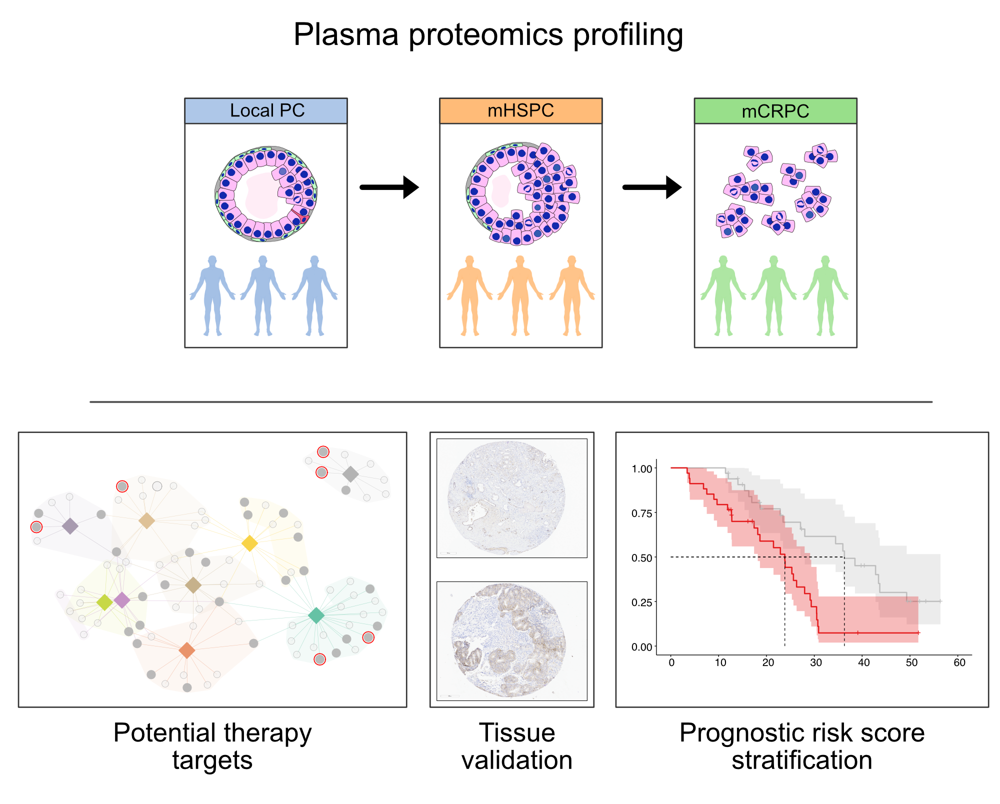

README

To characterize the progressive proteomic landscape of prostate cancer, we performed high-throughput plasma proteomic profiling across localized prostate cancer (**local PC**), metastatic hormone-sensitive prostate cancer (**mHSPC**), and metastatic castration-resistant prostate cancer (**mCRPC**).

We identified proteins overexpressed in mCRPC that were associated with poor survival and had potential as therapeutic targets. These findings were then validated in tissue using a tissue microarray and an independent tissue proteomics dataset.

